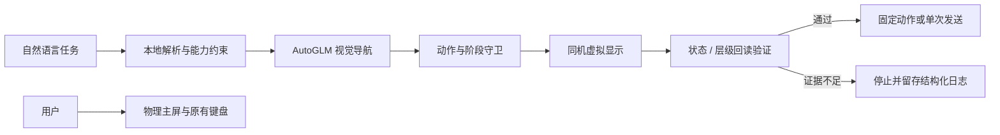

# Wellphone · 同一手机，互不抢屏

Wellphone 是一个 Android 后台手机 Agent 原型：用户继续使用物理主屏，Agent 在同一台手机的虚拟显示中运行应用。项目重点不是“多支持几个 App”，而是验证手机 GUI 任务能否与用户当前的屏幕、焦点、键盘和音频并行，并在证据不足时安全停止。

> 最新验收：在 HONOR Magic3 / Android 14 上，监督式流程已完成“启动抖音 → 找到指定联系人 → 输入 1 → 核对后发送”。本次 `passed=true`，主屏持续打字正常、无额外声音，副屏已关闭且音频设置已恢复。该结果是一次真机通过，不等于长期稳定性、对方收件回执或连续火花状态已验证。



## 已实现

| 能力 | 当前结论 |
| --- | --- |
| 同一物理设备上的独立虚拟显示 | 已实现并在 HONOR Magic3 / Android 14 验证 |
| 用户在主屏持续打字，Agent 操作副屏 | 多轮人工观察通过；不会切换输入法或使用剪贴板 |
| 副屏截图驱动的 AutoGLM 导航 | 已实现；抖音动态页面上仍有偶发误判或安全守卫停止 |
| 抖音播放音频限制、退出恢复原值 | 已验证；属于抖音应用级保护，不是通用音频隔离 |
| 向已聚焦的副屏编辑框定向输入固定 ASCII `1` | 基线实验通过 |
| 按命令指定联系人并监督式发送 `1` | 已在上述设备完成一次端到端通过；仍需人工核对，不承诺收件回执 |
| 中文输入、无人值守发送、账号身份认证 | 未实现 |

## 运行

已验收环境为 macOS Apple Silicon、HONOR Magic3 / Android 14、已授权 USB 调试，以及可用的 `adb`、scrcpy 4.1、ffmpeg 和项目既有 Python 环境。其他设备和系统版本未验收。

```sh
cd wellphone-delivery-20260909
export PHONE_AGENT_API_KEY="YOUR_AUTOGLM_API_KEY"
export WELLPHONE_BASE_VENV="/absolute/path/to/scrcpyvenv"

python3 run.py verify
python3 run.py tests
python3 run.py '在抖音给“联系人昵称”发送“1”' --dry-run
python3 run.py '在抖音给“联系人昵称”发送“1”' --serial AYYKVB1809001850
```

`PHONE_AGENT_API_KEY` 为 AutoGLM 接口密钥；副屏截图会按步骤发送到 AutoGLM 服务，不读取或上传主屏截图。`WELLPHONE_BASE_VENV` 指向现有虚拟环境；若恰好使用仓库默认开发机路径，可以省略。项目不需要 DeepSeek Key。

运行真实任务前，请确保联系人是自己的测试账号，主屏不要打开抖音。当前入口只接受“明确联系人＋数字 1”，其他文字会在连接手机前拒绝。程序仍保留首页、空白输入框、输入结果和发送按钮核对；它不是无人值守模式，任何层级截断、页面变化、身份不清或防重复记录都会停止。

## 设计取舍与边界

- 虚拟显示是 GUI 长尾任务的隔离执行面，不是完整 Agent；有系统接口的任务应优先走 Calendar、Alarm、API 或 MCP。
- 输入前必须同时确认虚拟显示、Activity、窗口、应用 UID、完整客户端层级和唯一获焦编辑框。当前设备原按 Activity token 的系统读取路径只有 60 ms 内部超时，现改用同权限、按副屏过滤的 2000 ms 路径；错误或未知格式仍然失败即停。
- 不清空旧草稿、不切换输入法、不读写剪贴板、不因结果不确定而重复输入或发送。运行日志和副屏私聊截图保存在 `experiments/douyin/outputs/`，已排除出 Git。
- “屏幕互不干扰”指用户可感知的交互资源隔离；CPU、内存、网络、电量和温度仍由同一设备共享。

早期成功的一轮只完成了副屏草稿 `1`，随后由用户手动发送；最新一次运行已由执行器点击发送并由用户核对外发状态。最适合演示的是：用户在主屏持续输入时，Agent 在副屏启动、导航、输入并发送，同时保持主屏、键盘和背景音乐正常。该流程仍是监督式原型，不是无人值守消息助手。

[当前入口与恢复方式](docs/BASELINE-ENTRY.md) · [焦点回读原因与验证](docs/INPUT-READBACK-BLOCKER.md) · [历史 ASCII 基线](experiments/douyin/baseline/douyin-ascii-v1.md)
