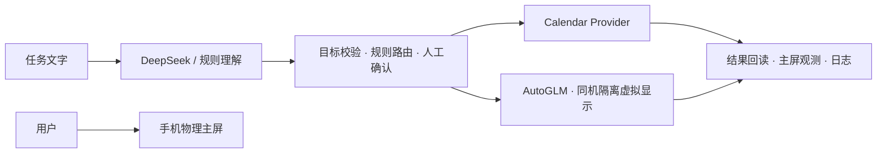

# Wellphone · 同一手机，互不抢屏

电脑负责理解与调度，手机负责执行；按已验证能力选择静默系统工具或隔离副屏。**交付主线：自然语言 → 日历写入＋设置副屏 → 真实结果回读，用户主屏持续打字。**



## 部署与演示

已验收：**macOS Apple Silicon＋HONOR Magic3 / Android 14**；USB 调试已授权，adb、scrcpy 4.1、ffmpeg 可用。附带客户端依赖本机 Homebrew 动态库，不是跨平台独立二进制。详见[部署](docs/DEPLOY.md)。

```sh
export WELLPHONE_BASE_VENV=/absolute/path/to/scrcpyvenv
export WELLPHONE_PLANNER_MODEL=deepseek-v4-flash
export WELLPHONE_PLANNER_BASE_URL=https://api.deepseek.com
python3 run.py verify
python3 run.py tests
python3 run.py router plan '明天下午4点安排30分钟的「交付演示」日程；打开设置，进入关于手机页面'
# 连接新工作目录首次需交互验收；会创建一条实际日程
python3 run.py router calendar-test
python3 run.py router run '明天下午4点安排30分钟的「交付演示」日程；打开设置，进入关于手机页面' --planner llm
```

API 密钥仅在本机：`DEEPSEEK_API_KEY` 用于理解，`PHONE_AGENT_API_KEY` 用于 AutoGLM；未设置时终端隐藏输入。模型名是本项目验收配置，不保证所有账号可用。执行需核对时间/日历并确认；按提示在主屏短信草稿持续打字，不发送短信。仅用 `plan` 不操作手机；LLM 模式仍会联网计费。

## 交付范围

`core/` 是已通过双通道基线的源码快照，主入口只运行它。`experiments/` 独立保存抖音固定数字输入及 Web 学习计划：**抖音未验收发送，Web 新版未验收完整手机闭环，中文按键输入预检失败**。不支持通用手机助手、支付、微信监听或手机 Web 面板。结果只在电脑显示；[证据与边界](docs/ACCEPTANCE.md)优先于快照中的历史说明。

[演示脚本](docs/DEMO.md) · [架构与答辩](docs/DESIGN.md) · [提交清单](docs/SUBMISSION.md) · [来源与许可](THIRD_PARTY_NOTICES.md)。新副本不含运行状态；不要与旧工作区并行操作同一手机，也不要靠删除日志重试。**尚未上传 GitHub、尚未附实拍视频。**
