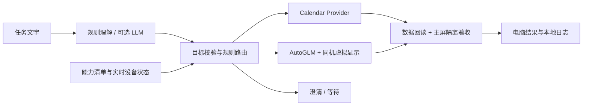

# Wellphone：同机、不抢主屏的能力路由 Agent

这是 Wellphone 的能力路由基线组件；当前默认交付入口是仓库根目录的抖音监督式流程。两者共享同机虚拟显示与主屏隔离理念，但本目录的日历/设置任务不等同于最新抖音发送验收。

理解目标，再按授权、实时状态和已验证能力选择执行方式。模型不能生成 shell 命令、改变权限或直接决定执行。首版支持单次日历事件与固定“设置→关于手机”GUI 任务；不支持支付、发消息、通知监听、中文 GUI 输入或通用 Type。



## 部署与运行

本机 macOS、Python 3.10+、adb、scrcpy 4.1、ffmpeg；USB 调试已授权。默认复用原 `scrcpyvenv`，不升级共享依赖。其他环境先自行准备 `app/requirements.txt` 中的依赖，并设置 `WELLPHONE_BASE_VENV`。本机已带焦点隔离服务端与原生帧客户端，启动时核对哈希。

```sh
cd /path/to/wellphone-router
python3 run.py tests                    # 离线测试，不操作手机
python3 run.py router plan '明天下午4点安排30分钟的「项目讨论」日程；打开设置，进入关于手机页面'
python3 run.py router doctor            # 只读设备/日历能力自检
python3 run.py router calendar-test     # 首次交互验收：预览并确认一条测试日程
python3 run.py router run '明天下午4点安排30分钟的「项目讨论」日程；打开设置，进入关于手机页面'
```

执行前：手机主屏短信草稿键盘已显示，不发送消息；主屏不打开日历/设置。先核对日期、时区、标题、日历 ID，再输入 `yes`；倒计时后持续打字。日历测试不调用模型，事件不设提醒、不发邀请，但可能同步到账号，测试后保留；可自行删除。异常 Ctrl+C。多设备用 `--serial`，多日历用 `--calendar-id`；失败不自动改权限、重发或切 GUI。

| 环境变量 | 用途 |
|---|---|
| `WELLPHONE_BASE_VENV` | 可选，默认使用本机已有的 scrcpyvenv |
| `PHONE_AGENT_API_KEY` | 仅 AutoGLM 使用；不要替换成 DeepSeek Key |
| `DEEPSEEK_API_KEY` | 官方 DeepSeek 接口的规划密钥；缺失时交互隐藏输入，不保存 |
| `WELLPHONE_PLANNER_API_KEY` | 其他兼容服务的规划密钥；不回退读取 AutoGLM / DeepSeek Key |
| `WELLPHONE_PLANNER_MODEL` | `--planner llm` 时必填，选择账号可用的通用模型；默认规则模式不调用模型 |
| `WELLPHONE_PLANNER_BASE_URL` | 可选 HTTPS 兼容接口，默认 `https://open.bigmodel.cn/api/paas/v4` |

DeepSeek 规划：设置 `WELLPHONE_PLANNER_MODEL=deepseek-v4-flash`、`WELLPHONE_PLANNER_BASE_URL=https://api.deepseek.com`，在同一终端安全导入 `DEEPSEEK_API_KEY`；先用 `router plan '任务文字' --planner llm`，只调用模型、不操作手机。截断/校验不合格即停止；校验失败保存本地脱敏诊断。详见[测试步骤](work/ROUTER.md#deepseek-只规划测试)。**规则模式是有限语法；LLM 的单个正例、三个边界样例及本机双通道实执行已通过，不代表任意任务都可执行。**

## 验证与边界

HONOR Magic3 / Android 14：GUI 基线、固定 ASCII、9月8日18:55静默日历、19:00规则双通道及19:53 LLM双通道均实测通过。路由器**不启用 ASCII Type**。新设备首次须跑 `calendar-test`，按设备、系统版本与执行实现哈希登记资格。结果在 `outputs/router-*/result.json`；SQLite 日志防止超时/重启后重复写入，只有数据与隔离验收都通过才报完成。CPU/发热/掉帧、熄屏、其他机型及 App 未验收。

完整链路已冻结为 [`baseline-hybrid-agent-v1`](baseline/hybrid-agent-v1.md)（3417742）；原两个标签保留，本分支为 `feature/capability-router`。`python3 run.py verify` 校验93个原始文件。密钥、日志、截图、资格与操作记录均不入 Git，未推送 GitHub。详见[路由说明](work/ROUTER.md)。许可证沿用 `app/LICENSE` 与 `work/focus_experiment/LICENSE.scrcpy`。
