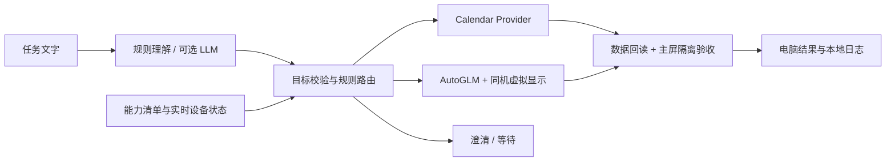

# Wellphone：抖音单数字实验

当前分支 `experiment/douyin-streak`，从已验收双通道基线独立扩展。用户已取消表情，改为副屏向自己的小号 `示例联系人` 输入并发送一条数字 `1`，主屏持续打字。应用级音频专项已真机通过；**抖音固定数字输入已有一次执行器实测和用户主屏正常反馈，完整发送尚未验收**。已保存 [checkpoint-douyin-ascii-v1](baseline/douyin-ascii-v1.md)，如实保留取消发送及等待期间查询报错。不是通用无人值守消息助手；专用输入器不切输入法，不调用上游通用 Type。

低帧率启动对照已单轮通过：19:38 display81只点击一次消息入口，转换检查约4.2秒通过，第二次模型截图确为消息列表，人工观察和音频恢复均正常。相比display80实时窗口与PNG不一致，此结果支持继续实验，但不证明长期无积压或完整发送。记录及边界见[低帧率验收](work/display_experiment/low-fps-acceptance.md)。`--low-fps-trial`请求副屏编码上限5fps，不改原生分辨率、解码器或动作保护；目前接入下列明确选择的完整流程，不默认启用。

当前低帧率完整实验入口：同次副屏首页→消息列表→最多6次滑动找示例联系人→空白输入框输入1→核对后发送。全程不弹图片，不逐步确认滑动；保留首页/消息页观察、输入前后核验和最后 `send 示例联系人` 授权。最大20次模型请求，旧草稿不清除，输入/发送尝试持久记录阻止盲目重跑。**尚未真机验收此完整流程；不是新的通过基线。**

```sh
python3 /Users/yishanma/Documents/Codex/wellphone-douyin-experiment/run.py douyin --send-one-flow --confirm-home-first --non-presentation --auto-messages --low-fps-trial --max-steps 20 --serial AYYKVB1809001850
```

非展示屏版本已在本机完成三次独立短时启动预检（display67/68/69）。仅去掉新副屏的PRESENTATION标记，保留焦点/键盘及音频保护，原服务端和冻结基线不变；见[验收范围](work/display_experiment/startup-acceptance.md)。以下 `--startup-only` 命令仍然**只到消息列表，不进会话、不输入、不发送**，不能与 `--send-one-flow` 同用。

```sh
python3 /Users/yishanma/Documents/Codex/wellphone-douyin-experiment/run.py douyin --startup-only --confirm-home-first --non-presentation --serial AYYKVB1809001850
```

用户要求取消弹图/逐步确认时，在上面命令追加 `--auto-messages`；复用本次通过的低帧率组合再追加 `--low-fps-trial`。仅允许本机1080×2400已测试布局的底部消息内区一次Tap，与同次人工确认首页及最新帧做连续性核对；不改坐标、不进会话、不输入/发送，不是通用语义识别。仍保留开头授权、首页输入`1`和最终消息列表观察；不调用图片预览程序。点击后被动等待最多20秒画面转换再请求模型，转换本身不等于成功；未知结果不重点击。带低帧率的组合已有一次启动测试通过，非长期稳定性证明。

非展示屏开关只允许无模型预检、带人工首页确认的消息接力，或上述显式单数字完整流程；不加该开关即原服务端。487项离线测试通过，93个冻结文件一致；不代表真机完整发送或长期稳定性验收。用户要求助手接管时，使用[本机一次性密钥交接与执行器独立测试](OPERATOR-TEST.md)，不读取终端历史、不保存密钥、不冒充真人观察。

当前提示版本`single-stage-v4-protocol-separation`：display83已由系统确认示例联系人会话编辑框获焦点，但模型复述了任务中的停止示例，旧解析器优先识别它而停止，尚未输入。现将动作格式放在系统提示，任务正文不含可执行示例；不从歧义回答中抢救最后一个动作。保留输入前真实焦点读取、双重检查和确认，完整流程单次响应上限1024 token。

固定数字输入现在由执行器路由：正确会话聚焦并通过系统归属检查后，直接进入原有固定 `1` 输入核验，不再额外要求模型生成 Type。可显式运行 `--executor-test` 隔离测试执行链；该模式由操作员依据当前副屏图提出受限导航，不调用 AutoGLM，报告明确记录 `autoglm_end_to_end_verified=false`。仅该实验允许两类严格限定的只读复核（AppOps 同值干净回读、同 Activity 完整客户端转储），不重放点击、输入或权限写入。详见 [独立测试边界](OPERATOR-TEST.md)。

保留`single-stage-v2-row-context`行区校验：19:15 display78已滑动找到示例联系人，但两次都提出目标行中部`[499,552]`，原x≤450限制阻止了分发。只将候选会话导航区扩到x≤550，原坐标不改写；点击前两次除目标点外还比较左侧头像/昵称行区域，避免白色中部掩盖联系人变化。右侧快捷操作、搜索仍禁止，输入/发送核对不变。仅为本机已观察布局的受限兼容，不是自动身份识别；display82已实际打开目标会话，输入和发送仍待验收。

19:04 display77已到消息列表，找人阶段第一步却提出右上搜索 `[813,69]`，没有实际点击、输入或发送。当前采用`single-stage-v1`：每轮用户消息只包含当前小任务与进度（列表找人/滑动、定位空白框、固定输入1、定位发送按钮），不再重复完整“找人并发送”目标。保留全部动作边界和人工输入/发送核验；不新增搜索或搜索失败自动重试。请求记录保存`prompt_version/substage/task`便于核对。真实模型是否稳定遵循尚待验收。

历史18:53 display76已到消息列表并滑动两次，原生帧可见示例联系人；模型提出行中部Tap `[499,594]`，因原左侧范围x≤450而未分发。当时加入明确数值边界及一次未执行提案的重新定位，未扩大点击范围；display78显示模型仍无法重新定位，当前改动见上。旧失败结果保留。

15:04 display73，消息点击后的转换等待完成，第二次模型已描述真实消息列表；但返回自然语言而非精确 `MESSAGES_READY`，原测试因格式停止，未输入/发送。现在仅在同屏已尝试消息点击并观察到画面转换后，允许这类结束语进入人工消息页核验；输入 `messages` 才继续，不猜关键词或自动记成功。

14:47 display72已实际点击一次，用户观察及稍后本地截图都证实进入消息列表；但第二次模型请求的图片仍是首页，其重复Tap被拒绝，整轮未通过。模型读取原生PNG而非电脑窗口，弹图遮挡不是目前证据支持的原因；页面加载/传输解码延迟仍待区分。新增转换等待用于避免过早核验，并未测得或保证设备采集帧的端到端时延。

明确开屏广告可先等其自然结束；首页确认在电脑终端输入 `1`，缺少导航输入 `0`，取消输入 `q`。广告页到首页可在同一副屏内自然切换，确认后才固定后续校验起点；未知输入不会自动批准。

不带 `--auto-messages` 时，漏标签的底部候选Tap只进入红圈人工核对。自动模式及完整流程的首页阶段另有显式授权、限定区域和连续性检查；这不是通用动作语义证明。输入/发送仍逐次核对。

14:31 display70 被2像素微移拦截；14:39 display71 又在人工确认后因3像素微移及轻微色差停止，两轮均未点击。当前仅在人工首页接力使用`messages_structure_v2`：候选区及左右导航须保持高度一致的RGB结构、共同有界平移；32像素预览圆必须由用户确认完整位于消息按钮内，位移每轴最多圆半径的1/4，不改坐标。人工核对和点击前新帧复查仍必需；其他导航、输入/发送规则不变。两轮失败图片对已离线通过，**真机消息点击仍待验收**，不视为无人值守导航。

接力模型分为“定位外层消息入口”和“核验真实消息列表”两阶段；明确区分视频里的聊天截图与真实App控件，禁止先点首页。此提示词调整尚待真机验收，不新增动作、不放宽人工核对。

排查间歇性导航缺失时改用 `--preflight`（不加两个启动参数）：不调用模型、不点击，启动后及用户回答前台/导航问题后自动留存副屏窗口诊断，再退出恢复音频；无需保持现场等人工抓取。窗口匹配失败只记录固定原因，不放宽匹配。

设备查询失败会记录固定命令类别、返回码及错误信号，不记录原始输出或完整命令；仍立即停止、不自动重试。音频准备失败且本轮未写入时，恢复状态记为未执行，不再与“恢复失败”混淆。9月9日13:50的间歇报错尚未复现，不能视为已修复。

```sh
python3 /Users/yishanma/Documents/Codex/wellphone-douyin-experiment/run.py douyin --preflight --non-presentation --serial AYYKVB1809001850
```

最多8次模型请求、连续等待最多2次、3次同屏抖音 Activity 变化后的重新观察；模型每轮收到执行器的已完成动作/等待进度。丢弃旧提案，不重放动作、不重试模型错误。主屏/音频/显示归属异常仍停止。同屏接力尚待真机验收，原数字发送入口保留。

运行前查看 [DOUYIN-TEST](DOUYIN-TEST.md)；恢复见 [AUDIO-TEST](AUDIO-TEST.md)。93个冻结文件不变。抖音/音频入口与 router/Web 共用设备锁，旧发送及音频恢复记录不迁移、不删除；新增输入尝试记录，未知结果不重输。主屏失败记录保留当刻结构化状态，不记录主屏文字。以下为继承的路由基线说明，不代表抖音已完成验收。

## 继承的双通道架构

理解目标，再按授权、实时状态和已验证能力选择执行方式。模型不能生成 shell 命令、改变权限或直接决定执行。首版支持单次日历事件与固定“设置→关于手机”GUI 任务；不支持支付、发消息、通知监听、中文 GUI 输入或通用 Type。



## 部署与运行

本机 macOS、Python 3.10+、adb、scrcpy 4.1、ffmpeg；USB 调试已授权。默认复用原 `scrcpyvenv`，不升级共享依赖。其他环境先自行准备 `app/requirements.txt` 中的依赖，并设置 `WELLPHONE_BASE_VENV`。本机已带焦点隔离服务端与原生帧客户端，启动时核对哈希。

```sh
cd /Users/yishanma/Documents/Codex/wellphone-router
python3 run.py tests                    # 离线测试，不操作手机
python3 run.py router plan '明天下午4点安排30分钟的「项目讨论」日程；打开设置，进入关于手机页面'
python3 run.py router doctor            # 只读设备/日历能力自检
python3 run.py router calendar-test     # 首次交互验收：预览并确认一条测试日程
python3 run.py router run '明天下午4点安排30分钟的「项目讨论」日程；打开设置，进入关于手机页面'
```

执行前：手机主屏短信草稿键盘已显示，不发送消息；主屏不打开日历/设置。先核对日期、时区、标题、日历 ID，再输入 `yes`；倒计时后持续打字。日历测试不调用模型，事件不设提醒、不发邀请，但可能同步到账号，测试后保留；可自行删除。异常 Ctrl+C。多设备用 `--serial`，多日历用 `--calendar-id`；失败不自动改权限、重发或切 GUI。

| 环境变量 | 用途 |
|---|---|
| `WELLPHONE_BASE_VENV` | 可选，默认 `/Users/yishanma/Desktop/wellphone/scrcpyvenv` |
| `PHONE_AGENT_API_KEY` | 仅 AutoGLM 使用；不要替换成 DeepSeek Key |
| `DEEPSEEK_API_KEY` | 官方 DeepSeek 接口的规划密钥；缺失时交互隐藏输入，不保存 |
| `WELLPHONE_PLANNER_API_KEY` | 其他兼容服务的规划密钥；不回退读取 AutoGLM / DeepSeek Key |
| `WELLPHONE_PLANNER_MODEL` | `--planner llm` 时必填，选择账号可用的通用模型；默认规则模式不调用模型 |
| `WELLPHONE_PLANNER_BASE_URL` | 可选 HTTPS 兼容接口，默认 `https://open.bigmodel.cn/api/paas/v4` |

DeepSeek 规划：设置 `WELLPHONE_PLANNER_MODEL=deepseek-v4-flash`、`WELLPHONE_PLANNER_BASE_URL=https://api.deepseek.com`，在同一终端安全导入 `DEEPSEEK_API_KEY`；先用 `router plan '任务文字' --planner llm`，只调用模型、不操作手机。截断/校验不合格即停止；校验失败保存本地脱敏诊断。规则模式是有限语法；9月8日19:53真实 LLM 双通道已通过，见[验收记录](baseline/hybrid-agent-v1.md)。

## 验证与边界

HONOR Magic3 / Android 14：GUI 基线、固定 ASCII、9月8日18:55静默日历及19:00规则双通道联调均实测通过。路由器**不启用 ASCII Type**。新设备首次须跑 `calendar-test`，按设备、系统版本与执行实现哈希登记资格。结果在 `outputs/router-*/result.json`；SQLite 日志防止超时/重启后重复写入，只有数据与隔离验收都通过才报完成。CPU/发热/掉帧、熄屏、其他机型及 App 未验收。

`baseline-no-steal-v1`、`checkpoint-ascii-v1` 和 `baseline-hybrid-agent-v1` 保留。`python3 run.py verify` 校验 93 个原始文件。密钥、日志、截图、日历资格记录和操作日志均不入 Git，尚未推送 GitHub。详细决策与复测见 [路由说明](work/ROUTER.md)。许可证沿用 `app/LICENSE` 与 `work/focus_experiment/LICENSE.scrcpy`。
