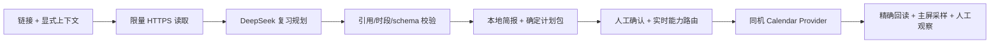

# Wellphone：技术资料 → 个性化复习计划 → 静默日历

这是独立的 Web Context 研究分支，不是当前抖音默认入口。抖音最新监督式端到端验收记录见仓库根目录 README；本目录的手机日历闭环仍按下文状态执行。

读取给定公开资料，结合背景、关注点和明确可用时段生成带来源的复习简报，经核对后在同一台手机后台创建日程并回读验证。用户主屏持续打字。独立分支 `feature/web-context`，保留原同机虚拟显示与双通道基线。



## 本机运行

macOS、Python 3.10+、已配置的 `scrcpyvenv`、adb、手机 USB 调试授权；复用依赖，不自动升级，不安装 APK/新权限。Web 路径不启动副屏或 AutoGLM。完整步骤见 [WEB-CONTEXT](work/WEB-CONTEXT.md)。

```sh
cd /path/to/wellphone-web-context
export WELLPHONE_PLANNER_MODEL="deepseek-v4-flash"
export WELLPHONE_PLANNER_BASE_URL="https://api.deepseek.com"
export WELLPHONE_WEB_PROXY="http://127.0.0.1:7897"  # 当前 Mac 的本机代理；直连网络不用
python3 run.py web init       # 输入真实开始时间与时长，生成可编辑 context.json
# 按输出路径运行 web plan --context '...'：一次模型请求，不连接手机
# 核对 brief.md 与 evidence.md，再运行 web apply --bundle '...'：不调用模型，确认后写手机
python3 run.py tests          # 离线验证
python3 run.py verify         # 93 个冻结源文件哈希
```

| 环境变量 | 用途 |
|---|---|
| `DEEPSEEK_API_KEY` | 原终端规划密钥；缺失时隐藏输入，不保存 |
| `WELLPHONE_PLANNER_MODEL` / `WELLPHONE_PLANNER_BASE_URL` | 明确选择模型/接口，不自动试用或切换 |
| `WELLPHONE_WEB_PROXY` | 可选本机 HTTP 代理；代理模式只允许默认两个官方文档域名 |
| `WELLPHONE_STATE_ROOT` | 可选共享资格/防重状态根；本机默认兄弟目录 `wellphone-router` |
| `WELLPHONE_BASE_VENV` | 可选 Python 环境；默认使用本机已有的 scrcpyvenv |

写入前须已通过原 `router calendar-test`，主屏短信草稿键盘显示，不发短信、不打开日历。确认 ID/标题/时间后输入 `yes`，倒计时后持续打字。事件可能同步账号，无提醒/邀请/手机通知，不自动删除。只写标题与时段，详细简报在电脑。未知结果不重试，共享原 journal，不清空日志绕过防重。

## 验证与边界

199 项离线测试及新版三篇官网实际读取通过。9月9日11:48旧版真实模型已生成计划，但存在背景与引用质量问题，未执行手机写入；**本轮修正后的模型内容质量和手机端到端仍待验收**。已修复源码换行切碎段落，区分项目事实/网页依据/学习建议，并生成逐项引用核对文件。引用存在不证明语义正确；未读已有日程，不能保证无冲突。支持1–3篇公开 HTML/文本、1–3个明确时段，截断会标记。不登录、执行 JS、读取主屏/聊天或调用任意命令。输出不入 Git，未推送 GitHub。

原基线 [`baseline-hybrid-agent-v1`](baseline/hybrid-agent-v1.md)（3417742）及 GUI/ASCII 标签不变；其他路线见[原路由说明](work/ROUTER.md)。许可证沿用 `app/LICENSE` 与 `work/focus_experiment/LICENSE.scrcpy`。
